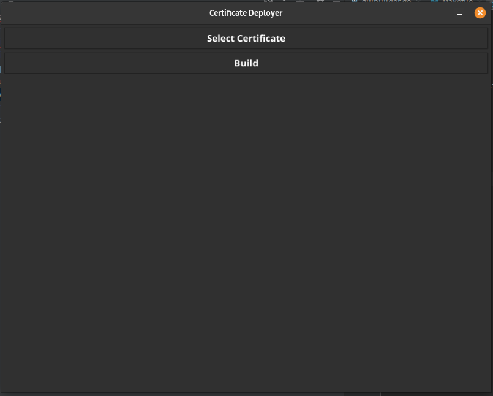
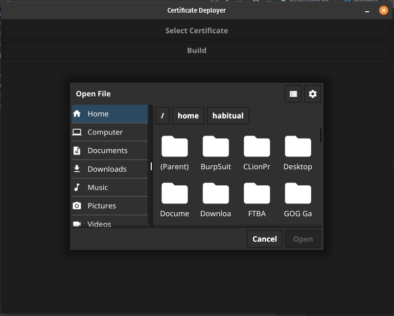

<h1 style="text-align: center">Certificate Deployer</h1>
<h3 style="text-align: center">Simple utility to create a certificate deployment agent</h3>
<body>
<h2>Installation</h2>

    To build the certificate deployer builder, just run "make"

<h2>Usage</h2>

   Use the appropriate build in the "bin" directory to create a certificate deployer.

<h3>Main Window</h3>

<h3>File Dialog</h3>

</body>